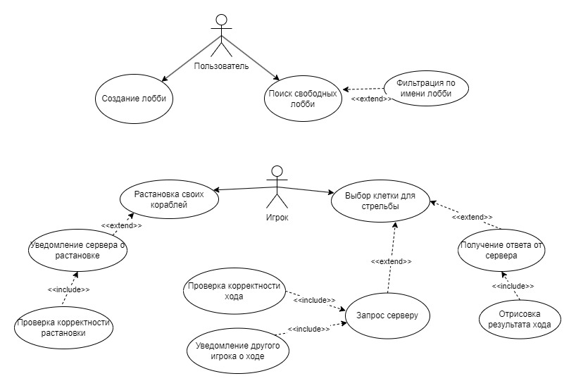

# Многопользовательская компьютерная 3D игра «морской бой»

Разрабатываемое программное средство представляет собой нативное (для операционной системы Windows10+)
приложение, позволяющее осуществлять многопользовательские игровые сессии для игры в классическую 
настольную игру «Морской бой». Оно должно предоставлять пользователю графический интерфейс; браузер для
поиска игровых лобби; базовую игровую логику.

Выполнил Ковальчук Фёдор Андреевич, гр. 353504

### Функциональная модель ПО

Функциональная модель программного средства представлена в виде диаграммы возможных событий и ответной
реакции приложения на них.

Программное средство поддерживает простое создание игровых лобби(комнат) для совместной игры. Для этого
не требуется перенаправление портов и создание публичного IP. Для реализации многопользовательского 
функционала используются набор инструментов Steam. После создания лобби оно отобразится у других
игроков в браузере лобби, и они соответственно могут выбрать нужное им лобби и подключится к нему. После
подключения сервер ожидает ответа о готовности от обоих игроков, после получения запускается первыый этап игры 
для расстановки своих кораблей. После ответа от обоих пользователей о завершении расстановки своих кораблей 
начинается второй этап игры, в котором оба игрока пошагово стреляют в часть поля противника. После того как 
у кого-то из игроков не остаётся ни одного корабля, он считается проигравшим, а второй игрок соответственно 
выигрывает. Игровая сессия завершается, игроки отключаются.

Функционал создания или поиска игровых сессий:

- Создание игрового лобби
- Приглашение друзей в лобби
- Удаление игроков из лобби
- Поиск доступных игровых лобби с фильтром (по имени)

Функционал игрового меню:

- Главное меню игры
- Меню браузера публичных лобби
- Меню для манипуляций над текущей игровой сессией (выбор вида корабля для расстановки, выбор квадрата-цели 
на поле соперника, возможность сдаться и покинуть не завершённую игру.

 ### Функциональные требования 

Функция поиска или создания игры:

- Пользователь указывает имя для лобби и его тип (публичный или приватный).
- Пользователь может пригласить другого игрока или дождаться пока тот сам найдёт лобби и подключится к нему.
- Владелец лобби может удалить из него игрока по необходимости.
- Оба игрока могут установить статус готовности после чего начнётся игра.

Функция установки кораблей на своё игровое поле:

- Игрок может выбрать один из четырёх кораблей (количество кораблей разных типов определено в соответствии 
с правилами игры «Морской бой».
- Выбранный корабль можно вращать на 90 градусов и установить в любую точку игрового поля, если у положения 
соблюдён боковой интервал в одну клетку с каждой стороны.
- После неудовлетворяющей установки корабля его установку можно отменить.
- После конца установки всех своих кораблей игрок может сообщить серверу о своей готовности, информация 
о положениях всех кораблей отправляется на сервер где проверяется и сохраняется при успехе проверки, 
сервер устанавливает готовность игрока и после готовности обоих игроков игра начинается.

 Функция основной игровой механики:

- Выбор первоочерёдности хода выбирается сервером случайным образом, далее он поочерёдно 
передаётся от игрока к игроку.
- Игрок, совершающий ход, выбирает клетку (на поле 10 на 10 клеток) в которую хочет отправить снаряд, 
запрос на ход отправляется на сервер, который проверяет возможен ли такой ход, при возможности хода 
проверяет убил ли игрок корабль противника, ранил или вообще промахнулся и отсылает соответствующее 
сообщение обоим игрокам, а также отсылает сообщение о передаче хода другому игроку.
- Оба игрока отрисовывают результаты хода друг друга.
- После того как уничтожен последний корабль одного из игроков, игровая сессия заканчивается, на 
экране победителя отрисовывается победное сообщение и оба игрока удаляются с сервера. 
